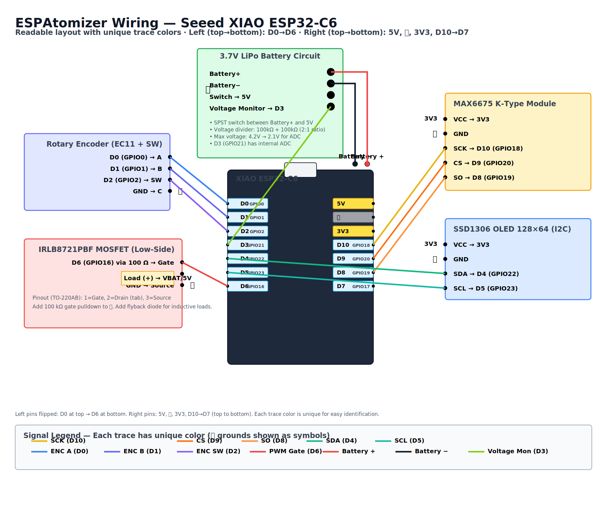

# ESP PID Temperature Controller — Seeed Studio XIAO ESP32C6 with ADS1115 I2C Thermocouple

This wiring guide targets the Seeed Studio XIAO ESP32C6 (Arduino core v3.x) with ADS1115 I2C-based thermocouple measurement. It matches the sketch at `ESPAtomizer/ESPAtomizer.ino` configured for the PCB v3 design.

- Sensor: K‑type thermocouple via ADS1115 16-bit I2C ADC (0x48). 3.3 V native operation. Enabled by default (`USE_ADS1115=1`).
- Output: PWM to MOSFET (heater) at ~200 Hz (disabled by default for safety)
- Controls: Rotary encoder with push switch (Adafruit PID 377 / EC11‑style) for setpoint and mode/power
- Display: Optional SSD1306 I2C OLED (128×64), address 0x3C typical (silk "0x78" = 0x3C 7‑bit)
- **Power:** 3.3V design (no external 5V requirement). All peripherals share 3.3V rail.

## Pin Assignments (by GPIO)

The sketch uses explicit GPIO numbers (printed at boot). Wire to these GPIOs, not Dx labels:

| Function              | GPIO   | Header Location | Type   | Notes |
|-----------------------|--------|----------------|--------|-------|
| Battery sense         | GPIO0  | Left pin 1 (D0) | ADC    | `BAT_PIN` (ADC1_CH0) via divider |
| Unused (was AD8495)   | GPIO2  | Left pin 3 (D2) | — | Thermocouple now via I2C ADS1115 |
| PWM output (MOSFET)   | GPIO16 | Left pin 7 (D6) | PWM    | `OUTPUT_PIN` (LEDC pin‑API) |
| Encoder A             | GPIO17 | Right pin 8 (D7/RX) | Input  | `ENC_PIN_A` (INPUT_PULLUP) |
| **I2C SCL (shared)**  | GPIO19 | Right pin 9 (D8/SCK) | I2C    | I2C clock (OLED 0x3C + ADS1115 0x48, ~400 kHz) |
| **I2C SDA (shared)**  | GPIO20 | Right pin 10 (D9/MISO) | I2C    | I2C data (OLED + ADS1115 thermocouple) |
| Encoder Switch (SW)   | GPIO22 | Left pin 5 (D4) | Input  | `ENC_PIN_SW` (INPUT_PULLUP) |
| Encoder B             | GPIO23 | Left pin 6 (D5) | Input  | `ENC_PIN_B` (INPUT_PULLUP) |

Board power and rails:
- 3V3 pin → 3.3 V output
- GND → Ground
- 5V pin is USB VBUS; don’t power 3.3 V sensors/displays from 5 V.
 - BAT pad (pad 32 on the XIAO module) is bidirectional: with a LiPo attached it powers the board, and with USB attached the on‑board charger can source current out to the LiPo via BAT. Treat any pogo/test pads tied to BAT as the battery rail (not input‑only). Never tie BAT to 5 V (VBUS).

## Wiring Diagram

The new schematic emphasizes readability and matches the final XIAO ESP32‑C6 pin mapping. It includes the MAX6675, SSD1306 OLED (I2C), rotary encoder (A/B/SW), and the IRLB8721PBF MOSFET output.
Power rails are labeled at module pads (3V3/GND) rather than drawn as traces to reduce clutter.



Legend (colors in the diagram):
- Green = I2C (SDA/SCL)
- Orange = MAX6675 SPI‑like (SCK/CS/SO)
- Blue = Rotary encoder (A/B/SW)
- Red = PWM output to MOSFET gate
- Purple = 3V3, Black = GND

### Quick wiring checklist

Rotary encoder (Adafruit 377 / EC11 with push switch):
- A → GPIO17 (D7/RX, right header pin 8)
- B → GPIO23 (D5, left header pin 6)
- C (common) → GND
- SW → GPIO22 (D4, left header pin 5); the other SW terminal → GND
- No VCC needed (mechanical). Firmware enables internal pull‑ups; optional 100 nF caps from C→A and C→B improve debounce.

### Encoder quick test
- Upload `ESPAtomizer/ESPAtomizer.ino` and open Serial Monitor @ 115200.
- On boot you should see pin printouts: `Pins: AD8495=2(ADC1_CH2/D2), OUT=16(D6), ENC_A=17(D7), ENC_B=23(D5), ENC_SW=22(D4), SDA=20(D9), SCL=19(D8), BAT=0(ADC1_CH0/D0)`.
- Rotate the encoder: you should see `[ENC] det=±1 => Setpoint=...` messages and the OLED target changing.
- Press/release SW: short press toggles Power; long press toggles PID mode (watch OLED tag [AUTO]/[MAN]). Long press again enters menu with modes: AUTO, MAN, U1, U2, Config, Exit.
- In Config mode (select via menu), encoder adjusts default setpoint (persisted in RTC); short press exits.

### Config Mode
- Accessible via encoder menu (long press SW, select "Config").
- Adjust default setpoint for Auto mode using encoder.
- OLED displays "Config: Default SP: XXX.X C".
- Short press SW to exit; setting is saved to RTC.

### Debug Logging
- Firmware logs BLE connection status, battery, temperature, and mode every 10 seconds (e.g., `[DEBUG] BLE connected: 1, Bat: 3.80V (85%), Temp: 25.0C, Mode: 0`).
- Useful for troubleshooting disconnections or power issues.

OLED (SSD1306 128×64) on I2C:
- VCC → 3.3V
- GND → GND
- SDA → GPIO20 (D9/MISO, right header pin 10) [shared with ADS1115]
- SCL → GPIO19 (D8/SCK, right header pin 9) [shared with ADS1115]
- Address: 0x3C typical. Many boards print 8‑bit addresses on silk ("0x78" for write) — this corresponds to 7‑bit 0x3C.
- **ADS1115 I2C Bus:** The OLED and ADS1115 thermocouple IC share the same I2C bus (GPIO19/20) at different addresses (0x3C vs 0x48) — no conflicts.
- If bus idles at ~0 V, add 4.7k pull‑ups from SDA→3.3V and SCL→3.3V (some modules omit pull‑ups).

MOSFET output (heater at ~4 V supply):
- Gate → GPIO16 (D6) via 100 Ω resistor
- Gate → 100 kΩ pull‑down to GND
- Source → GND (common ground with ESP and heater supply)
- Drain → heater negative; heater positive → +4 V supply
- Use a Schottky diode for inductive loads (fans): anode to GND, cathode to +4 V
- PWM default: ~200 Hz, 10‑bit; output is disabled in current sketch until we enable PID.

IRLB8721PBF pinout (TO‑220AB): 1 = Gate, 2 = Drain (tab), 3 = Source. The metal tab is connected to Drain.

LED test load (replace heater):
- Keep the MOSFET wiring exactly as above; simply replace the heater with an LED in series with a resistor.
- LED anode (+) → series resistor → +supply (same supply you would use for the heater)
- LED cathode (−) → MOSFET drain (the same pad the heater “−” used)
- MOSFET source → GND (unchanged)
- Gate, pull‑down, and common GND remain the same.

Resistor suggestions (safe, visible brightness):
- 3.3 V supply: 330 Ω to 1 kΩ
- 5.0 V USB/VBUS: 680 Ω to 1.5 kΩ
- 1S Li‑ion (3.7–4.2 V): 470 Ω to 1 kΩ

Tip: If the LED seems very dim, try a lower value within the suggested range (e.g., 330–470 Ω). If it’s too bright or you want to reduce current, increase the resistor (e.g., 1 kΩ).

## Using the board's 5 V (VBUS) to power the load

Yes—on the XIAO ESP32‑C6 the 5 V pin is USB VBUS. You can power your MOSFET‑switched load from this pin with these caveats:

- VBUS is only present when USB is connected.
- Current is limited by the USB source and cable (typically 500 mA on many ports). Don’t exceed your port’s rating.
- The ESP32 GPIO drives the MOSFET gate at 3.3 V. Use a logic‑level MOSFET with low Rds_on at Vgs=2.5–3.3 V (e.g., AO3400A, IRLML6344; large can MOSFETs like IRLZ44N also work but are oversized).
- For heavier loads, use an external 5 V supply and keep grounds common with the ESP (tie GNDs together).

For LEDs on 5 V, choose a suitable series resistor (typical 680 Ω to 1.5 kΩ). For inductive loads (motors, relays), add a flyback diode across the load (e.g., 1N5819) oriented cathode to +5 V, anode to the MOSFET/drain side.

## Using a 1S LiPo as the external load supply

You can power the load from an external 1S LiPo (3.7–4.2 V). The ESP32 stays powered via USB/3V3; the LiPo powers only the load. Critical rule: share ground.

- LiPo + → load +; load − → MOSFET Drain; MOSFET Source → GND
- ESP32 GND ↔ LiPo − (common ground)
- GPIO16 (OUTPUT_PIN) → 100 Ω → Gate; 100 kΩ Gate → GND (pulldown)
- For inductive loads add a flyback diode (cathode to LiPo +, anode to Drain)

Tip for LEDs on LiPo: use a 470 Ω–1 kΩ series resistor (depending on desired brightness).

## Powering the entire device from a 1S LiPo

The XIAO ESP32‑C6 exposes BAT pads for a 1S LiPo. You can power the whole device (ESP32 + peripherals + heater output) from a single 1S pack:

- Connect LiPo to the board’s BAT+ / BAT− pads (see the board silkscreen). The onboard regulator supplies 3.3 V to the ESP32 and I2C devices.
- Heater still uses the LiPo + as its supply; low‑side MOSFET switches the return to GND.
- Keep grounds common (they already are when using the BAT pads).

Caveats:
- Check the XIAO ESP32‑C6 documentation for charging behavior and max current from BAT. If you also connect USB, ensure the power path is supported by the board (many XIAO variants include charge management, but verify your revision).
- Use a hardware battery disconnect switch (SW1) inline with BAT+ so you can fully cut power when OFF; avoid shorts as LiPo packs can source very high currents.
- Use wide copper/wires for the heater path (see PCB notes below).
 - If you use pogo/test pads (TP4/TP5) they are intended as service/debug access points — for permanent battery wiring use the JST‑PH connector (`J3`) on the board edge. Remember BAT is bidirectional: with USB attached the charger circuitry may source current to a LiPo, and with LiPo attached those pads will carry battery current. Do not connect BAT pads to 5 V (VBUS).

## Thermocouple (ADS1115 I2C)

Primary temperature sensor is a K‑type thermocouple using an ADS1115 16-bit I2C ADC (address 0x48) for 150–400 °C operation. The ADS1115 shares the I2C bus with the OLED display (no additional pins required).

- **Power:** VCC=3.3 V, GND=GND
- **I2C Interface:** SDA=GPIO20, SCL=GPIO19 (shared with OLED at different address 0x3C)
- **Thermocouple Input:** AIN0 and AIN1 pins (differential measurement, K-type)
- **I2C Address:** 0x48 (ADDR pin tied to GND; address configurable via ADDR pin)

Firmware:
- Set `#define USE_ADS1115 1` near the top of the sketch.
- Set `#define ADS1115_I2C_ADDR 0x48` for default configuration.
- No external libraries required (uses Arduino Wire library).

## Software-Only Testing (no board)
- Quick tools overview: see [tools/README.md](../tools/README.md)
- Run the static smoke check to validate the sketch structure:
  - powershell -NoProfile -ExecutionPolicy Bypass -File "c:\Users\Adam Dinjian\OneDrive\Projects\Coding\ESPAtomizer\tools\smoke_check.ps1"
- Lint key config values and constraints:
  - powershell -NoProfile -ExecutionPolicy Bypass -File "c:\Users\Adam Dinjian\OneDrive\Projects\Coding\ESPAtomizer\tools\config_lint.ps1"
- Simulate PID logic without hardware:
  - powershell -NoProfile -ExecutionPolicy Bypass -File "c:\Users\Adam Dinjian\OneDrive\Projects\Coding\ESPAtomizer\tools\pid_sim.ps1" -Setpoint 180 -Kp 8 -Ki 0.3 -Kd 40 -DurationMs 15000 -StepMs 100 -Ambient 22 -PwmMax 1023
- To exercise firmware logic without I/O, enable TEST_MODE:
  - Edit [ESPAtomizer/config.h](../ESPAtomizer/config.h) and set `#define TEST_MODE 1`.
  - Effects: simulated temperature in `readTemperatureC()`, logging-only `applyOutput()`, and simulated battery in [ESPAtomizer/battery.h](../ESPAtomizer/battery.h).

Connection:
- U1 pin 1 (ADDR) → GND (sets address to 0x48)
- U1 pin 2 (GND) → Ground plane
- U1 pin 3 (SCL) → GPIO19 (I2C clock, shared with OLED)
- U1 pin 4 (SDA) → GPIO20 (I2C data, shared with OLED)
- U1 pin 5 (AIN0) → Thermocouple positive (red wire)
- U1 pin 6 (AIN1) → Thermocouple negative/reference (yellow wire)
- U1 pin 8 (VDD) → 3.3V with 100nF bypass cap to GND

**Multi-master I2C:** Both OLED (0x3C) and ADS1115 (0x48) operate simultaneously without conflicts.

Notes:
- Keep thermocouple leads twisted and away from heater switching traces to reduce noise.
- No SPI pins required — thermocouple measurement is entirely over I2C.
- 16-bit resolution provides better accuracy than 8-bit analog ADC.
- Internal reference and amplification — no external reference circuit needed (unlike AD8495 design).


## OLED I2C Address Note
- Many modules mark pads as 0x78 / 0x7A (8‑bit addresses). These map to 7‑bit addresses 0x3C / 0x3D used by Arduino.
- Keep the pad bridged to 0x78 for 0x3C. Our code scans for both 0x3C and 0x3D.

## Pin mapping note (avoid Dx confusion)

The sketch uses explicit GPIO numbers and also prints them at boot, for example:

```
Pins: BAT=0(D0), ENC_A=17(D7), ENC_B=23(D5), ENC_SW=22(D4), OUT=16(D6), SDA=20(D9), SCL=19(D8), ADS1115=0x48(I2C)
```

## Pins summary (Dx ↔ GPIO)

Left side (top→bottom):
- D0 → GPIO0: Battery monitor ADC (via divider)
- D1 → GPIO1: Available
- D2 → GPIO2: Unused (thermocouple via I2C ADS1115)
- D3 → GPIO21: Not used
- D4 → GPIO22: Encoder switch (active‑low)
- D5 → GPIO23: Encoder B
- D6 → GPIO16: PWM output to MOSFET gate

Right side (top→bottom):
- 5V (VBUS, not used in 3.3V design)
- ⏚ GND
- 3V3
- D10 → GPIO18: Available
- D9  → GPIO20: I2C SDA (OLED 0x3C + ADS1115 0x48)
- D8  → GPIO19: I2C SCL (OLED + ADS1115)
- D7  → GPIO17: Encoder A

Use these GPIO numbers when wiring; don't rely on Dx labels, which vary by core/board definitions.

Known‑good GPIOs matching the current sketch:
- `BAT_PIN = GPIO0` (battery ADC)
- `ENC_PIN_A = GPIO17`
- `ENC_PIN_B = GPIO23`
- `ENC_PIN_SW = GPIO22`
- I2C: `SDA=GPIO20`, `SCL=GPIO19` (shared OLED + ADS1115)
- `OUTPUT_PIN = GPIO16` (heater PWM)
- ADS1115: I2C address `0x48` (on GPIO19/20 I2C bus)

## Safety
- Start with heater supply disconnected; verify the MAX6675 reads ~room temp and setpoint changes with the encoder.
- Only then enable PID and PWM output.
- Ensure wiring/connectors are appropriate for expected temperatures and current; a thermal fuse is optional and typically omitted here to minimize cost.

## Wireless control from iPhone (Wi‑Fi web UI)

The firmware exposes a built‑in web UI over a Wi‑Fi SoftAP (no external router required). This works from iOS Safari and can be “Added to Home Screen” for an app‑like experience.

- Power the board; after boot it creates an access point named `Atomizer-XXYY` (XXYY are the last two bytes of MAC).
- Default password: `atomizer123` (change in firmware: `WIFI_AP_PASSWORD`).
- Join the AP from your iPhone, then open `http://192.168.4.1/`.

From the page you can:
- Toggle power ON/OFF
- Switch PID mode AUTO/MAN
- Set setpoint (°C)
- Tune Kp/Ki/Kd
- In MAN mode, set manual output (0..1023)
- Choose setpoint source (POT vs FIXED)

Status updates every ~1 s. Endpoints (for scripting):
- `GET /status` → JSON with:
	- `temp` (C), `setpoint` (C)
	- `kp`, `ki`, `kd`, `manual` (bool), `power` (bool)
	- `out` (0..PWM_MAX), `pwmMax`
	- `spmode` (bool for POT mode)
	- `batV` (volts) and `batPct` (0..100), or `null` if battery monitor is disabled/not sampled yet
- `GET /control?...` → Accepts `sp`, `kp`, `ki`, `kd`, `mode=AUTO|MAN`, `pwr=0|1|toggle`, `out`

To disable Wi‑Fi, set `#define USE_WIFI 0` in the sketch.

## Optional: BLE control (CoreBluetooth on iOS)

The sketch includes an optional BLE GATT service (disabled by default to keep dependencies minimal). Enable by setting `#define USE_BLE 1`.

Service UUID: `b09aa6b5-0f22-4d9c-9dbc-6e3c7d9b2f0a`

Characteristics (read/write unless noted):
- Enable (bool/"0" or "1"): `3f1a0001-2a8d-4a54-8f2f-b7cd2b4b8001`
- Setpoint (string/float): `3f1a0002-2a8d-4a54-8f2f-b7cd2b4b8001`
- Kp: `3f1a0003-2a8d-4a54-8f2f-b7cd2b4b8001`
- Ki: `3f1a0004-2a8d-4a54-8f2f-b7cd2b4b8001`
- Kd: `3f1a0005-2a8d-4a54-8f2f-b7cd2b4b8001`
- Mode ("AUTO"/"MAN"/"U1"/"U2"): `3f1a0006-2a8d-4a54-8f2f-b7cd2b4b8001`
- Mode Read (notifications for mode sync): `3f1a0006-2a8d-4a54-8f2f-b7cd2b4b8002` (Read/Notify: Int 0-4 for mode index)
- Output (int 0..1023): `3f1a0008-2a8d-4a54-8f2f-b7cd2b4b8001`
- Temperature (read/notify): `3f1a0007-2a8d-4a54-8f2f-b7cd2b4b8001`
- Battery % (read/notify): `3f1a0009-2a8d-4a54-8f2f-b7cd2b4b8001`
- Default Setpoint (write): `3f1a000a-2a8d-4a54-8f2f-b7cd2b4b8001` (Write: Float string, persisted in RTC)

You can test from iOS using the free "nRF Connect" app or the ESPAtomizer iOS app:
1) Scan and connect to "Atomizer".
2) Find the service by UUID; write values to change settings and subscribe to notifications.

Note: BLE uses NimBLE on ESP32. If your toolchain lacks `NimBLEDevice.h`, install "NimBLE-Arduino" and rebuild, or keep `USE_BLE` at 0.

## Power, Battery Logic, and Sleep Modes

- **Startup Behavior:**
  - When the device receives power (from battery or USB), it always powers on and boots the firmware.
  - The device restores its last saved state (setpoint, PID mode, output, etc.) from RTC memory.
  - If the last state was OFF, the device remains OFF; otherwise, it resumes operation automatically.
  - Physical hardware power switch (if present) fully disconnects battery and board; when switched ON, device boots immediately.

- **Battery Use and Unplugged Operation:**
  - The Atomizer always uses battery power if available. If unplugged from USB/external supply, it continues running on battery.
  - Device remains operational on battery unless explicitly turned off via button, BLE, or web interface.
  - All features (PID, BLE, OLED, encoder, etc.) are available on battery power.

- **Low Battery Handling:**
  - If battery voltage drops below the cutoff (`BAT_CUTOFF_V`), heating is disabled to protect the battery, but the device remains responsive for status, BLE, and UI.

- **Sleep Modes:**
  - The device enters deep sleep after a period of inactivity (default: 60 seconds, configurable via `SLEEP_ON_IDLE_MS`).
  - Deep sleep is aborted if any wake pins (encoder A/B/SW) are LOW, preventing unwanted sleep during user interaction.
  - On wake from sleep, the device restores its previous state from RTC memory and resumes operation.
  - The device will not enter deep sleep if the menu is active or recent activity is detected.

- **Power-Off Logic:**
  - The device only shuts down if the user turns it off (button press, BLE command, or web control).
  - Otherwise, it will run on battery until the battery is depleted or the device is manually powered off.

- **Physical Power Switch:**
  - If a hardware power switch is installed inline with the battery, switching it OFF fully disconnects power and turns off the device.
  - Switching ON restores power and the device boots immediately, regardless of previous software state.

---
